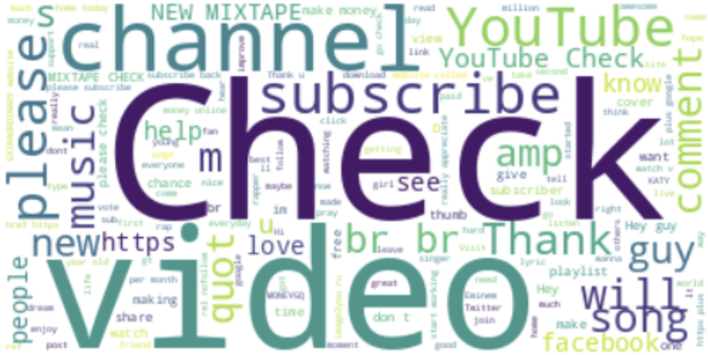
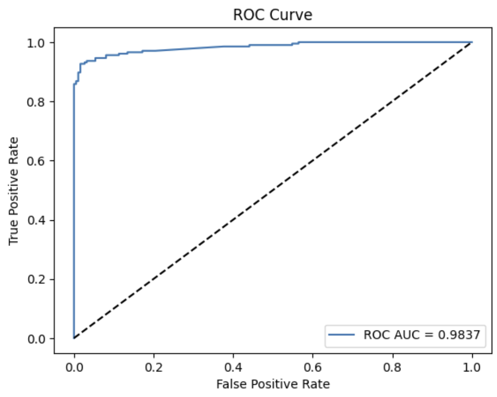
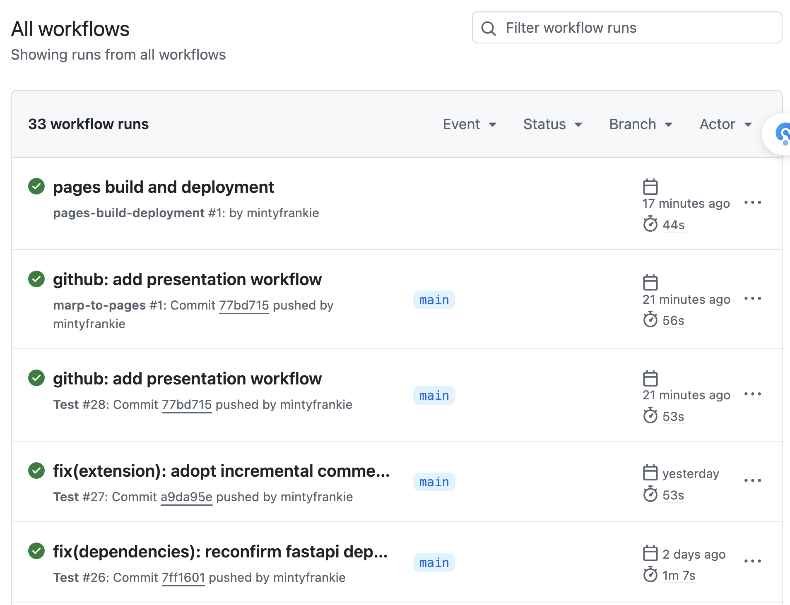

# **ML For Business II Final Project**
### Predicting YouTube Spam Comments

 

**Group Members:**
Elie LAFORGE
Yunan WANG

---

## **Introduction**
- Objective: Predict whether a YouTube comment is spam (`1`) or not (`0`).
- Dataset sourced from Kaggle, labeled in the `CLASS` column.

---

## **Dataset Overview**
- Dataset contains labeled comments from YouTube.
- Key features include comment_id, author, date, content and video name.

- Target column: `CLASS` (1 = spam, 0 = not spam).

---

## **Exploratory Data Analysis (EDA)**
### **Label Distribution**

- Analyze distribution of spam vs. non-spam comments.

---
## **Exploratory Data Analysis (EDA)**
### **Word Cloud**

- Visualizing common words in spam comments

---
## **Data Preprocessing**
- Data cleaning steps:
  - Handling missing values.
  - Removing duplicates.
  - Text vectorization using TF-IDF.

---

## **Model Selection**
- Tried different models:
  - Logistic Regression (tested with both TF-IDF and Count Vectorizer)
  - Bernoulli Naive Bayes
  - XGBoost
---

## **Model Evaluation**
- Metrics used:
  - Accuracy
  - Precision
  - Recall
  - F1 Score
  - ROC-AUC (Receiver Operating Characteristic Area Under the Curve)
- Compared performance across models.

---

## **Best Model : XGBoost**
- Best performance observed with XGBoost. 
- TF-IDF vectorization + hyperparameter tuning.
- Performance metrics:
  - Accuracy on test: 0.95
  - F1 Score: 0.95
  - ROC-AUC : 0.98

---

## **Results Visualization**
- Confusion matrix of the best model.
- Hyperparameters tuned:
  - learning rate = 0.2
  - max depth = 6
  - n estimators = 150

---

## **Recap**
- XGBoost + TF-IDF gave the best performance.
- Spam detection accuracy: 90%.

---

## **DevOps Structure: Chrome Extension** 

Frontend PoC with Chrome Extension

- Connect to backend API server deployed on Heroku.
- Dynamically insert a pill into the comment section to indicate the spam probability.

---

## **DevOps Structure: Testing**

Unit testing with pytest on API server, covering all the endpoints and edge cases; For example: 

- requests with empty content;
- malformed requests;
- internal server errors (model loading failure, etc.)

---

## **DevOps Structure: CI/CD**

Main tool: GitHub Actions

- Code quality check on commits & PRs (format, linting, unit testing)
- Build Docker image and push to GitHub Container Registry
- Deploy to Heroku worker
- Compile this Marp deck and publish to GitHub Pages

---

## **DevOps Structure: Experiment Tracking**

- MLFlow for experiment tracking on Databricks
  - Two environments: staging and production
  - Log parameters, metrics, and model artifacts.
- Leverage `mlflow.autolog()` to automatically log parameters, metrics, and model artifacts.

---

# Live demo time!

---

## **Next Steps**
- Potential improvements:
  - Use deep learning models (e.g., LSTM, BERT).
  - Experiment with more feature engineering.
  - Use an even larger dataset to have an even more general model

### **- Sell it to Youtube and live off the profits!**
